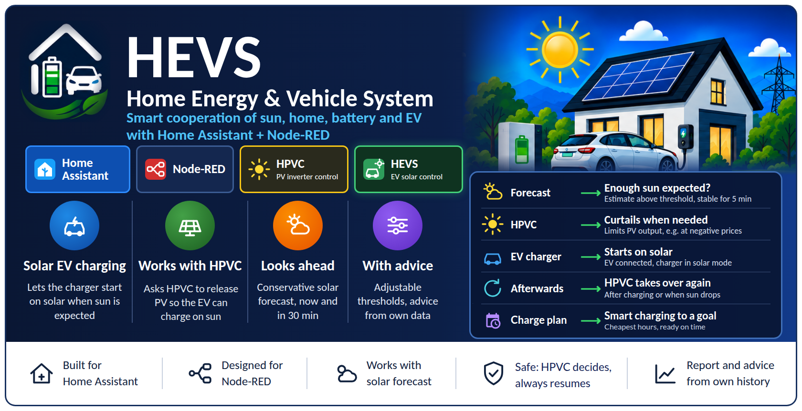
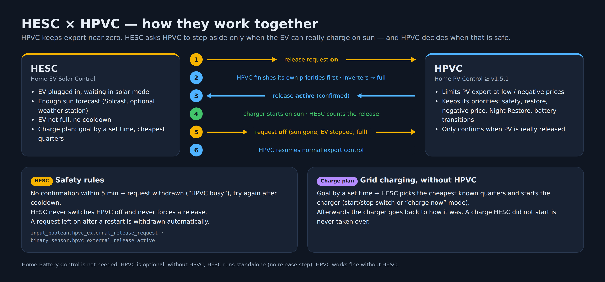
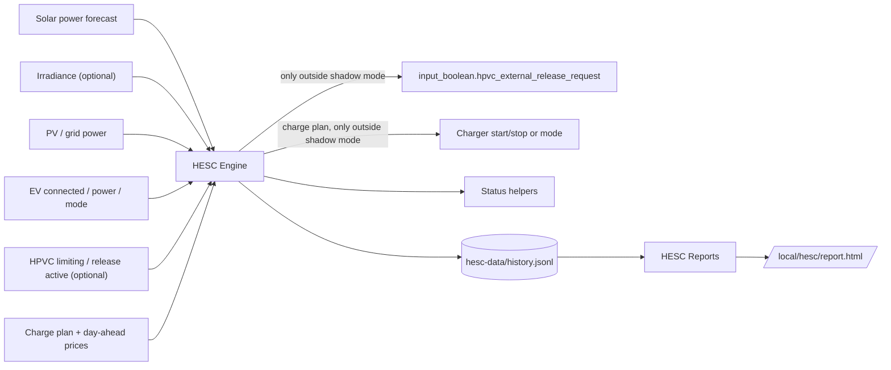
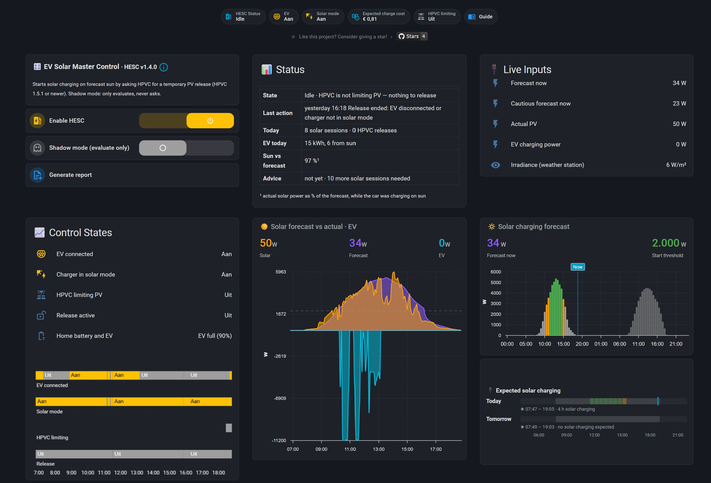
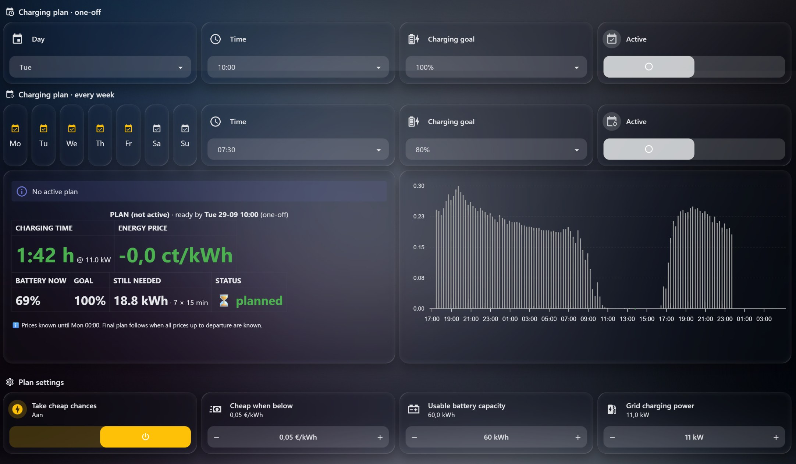
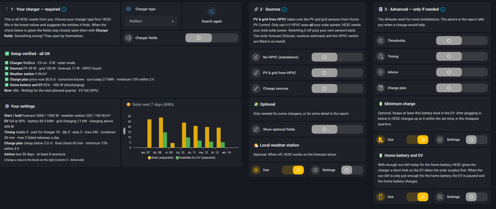
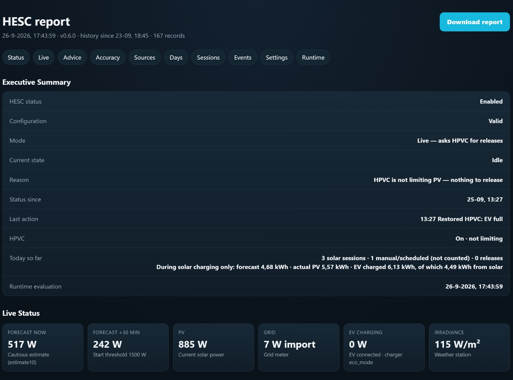

<p align="center">
  <a href="CHANGELOG.md"></a>
  <a href="https://www.home-assistant.io/"></a>
  <a href="https://nodered.org/"></a>
  <a href="LICENSE"></a>
  
</p>

<p align="center"></p>

# Home EV Solar Control 

**Home EV Solar Control (HESC)** is a smart companion for your EV charger in Home Assistant. It helps you charge your car on sunshine, and, when the car has to be full by a certain time, in the cheapest hours.

What HESC does for you:

- **Follows every solar charging session** and compares it with the solar forecast, so you see how much of your car's energy came from the sun.
- **Charge plan:** *"100% by Tuesday 10:00"* or *"80% on weekdays at 07:30"*. HESC picks the cheapest hours before that moment.
- **Advice in plain language**, based on your own history, for example the best start threshold for your house.
- **A support report** with everything it measured and decided.
- **Together with [Home PV Control (HPVC)](https://github.com/BioPC/home-pv-control):** when HPVC turns your panels down, HESC can ask HPVC to let the sun through for the car.

HPVC is optional: HESC runs **on its own (standalone)** or **together with HPVC**. See [Two ways to run HESC](#two-ways-to-run-hesc).

**See it in practice:** [a day at home with HESC](docs/06-a-day-in-practice.md), one real day with home batteries, solar panels, a car and changing weather.

> [!IMPORTANT]
> A new install starts in **shadow mode**: HESC evaluates and logs every decision, but never starts the charger and never asks HPVC for anything. Switch shadow mode off after you have checked the report for your own installation.

## Contents

- [Quick install](#quick-install)
- [Two ways to run HESC](#two-ways-to-run-hesc)
- [Main features](#main-features)
- [Requirements](#requirements)
- [Shipped defaults](#shipped-defaults)
- [How HESC works](#how-hesc-works)
- [Safety and recovery](#safety-and-recovery)
- [Accuracy, insights and reports](#accuracy-insights-and-reports)
- [Charge plan](#charge-plan)
- [Tested with](#tested-with)
- [Architecture and persistence](#architecture-and-persistence)
- [Documentation](#documentation)
- [Screenshots](#screenshots)
- [Wish list](#wish-list)
- [Support](#support)
- [Repository structure](#repository-structure)
- [Credits](#credits)
- [License](#license)
- [Disclaimer](#disclaimer)

## Quick install

0. No Node-RED yet (for example without HPVC)? Install the **Node-RED add-on** first, see [step 0 of the guide](docs/01-installation.md#0-what-you-need-first)
1. Enable Home Assistant packages: `homeassistant: packages: !include_dir_named packages`
2. Copy `home assistant/hesc_config.yaml` to `/config/packages/hesc_config.yaml`
3. Restart Home Assistant (first install creates the helpers and applies the defaults once)
4. Import `node-red/hesc_flow.json` into Node-RED, select your Home Assistant server on the action and trigger nodes, and deploy
5. Add `home assistant/hesc_dashboard.yaml` as a separate dashboard
6. Open **Settings** and fill in step 1, *Your charger* (see [examples](examples/)). With HPVC, PV and grid are taken over from HPVC; without HPVC, switch on *No HPVC (standalone)* and pick your PV and grid sensors in step 2. The forecast comes from Solcast. Until the required fields are complete the dashboard shows a setup checklist
7. Leave **shadow mode** on and check the report after a few charging days

Full guide: [docs/01-installation.md](docs/01-installation.md)

## Two ways to run HESC

| | Standalone | With HPVC |
|---|---|---|
| You need | Home Assistant, Node-RED, your charger, a solar forecast | the same, plus [Home PV Control](https://github.com/BioPC/home-pv-control) **v1.5.1 or newer** |
| Setting | *No HPVC (standalone)* **on** (a new install without HPVC does this by itself) | *No HPVC (standalone)* **off** |
| PV and grid power | you pick your own sensors | taken over from HPVC |
| Follow solar sessions, forecast vs actual, advice, report | ✅ | ✅ |
| Charge plan (cheapest hours) | ✅ | ✅ |
| Ask HPVC to let the sun through for the car | – (nothing holds the panels back) | ✅ |

**Why the release is needed with HPVC.** The solar/Eco mode of many wallboxes only starts when the house sends enough power back to the grid. HPVC does the opposite: when exporting does not pay, it turns the panels down so that export stays near zero. Both do their job, but together the wallbox waits for sunshine that never comes. HESC solves this: when the car is waiting in Eco mode, HPVC is holding the panels back and the forecast says enough sun is coming, HESC **asks HPVC for a temporary release**. HPVC decides when that is safe, turns the panels up and confirms. When the sun drops or the car stops, HESC withdraws the request and HPVC takes over again.

## Main features

| Feature | |
|---|:-:|
| Runs standalone (no HPVC needed) or together with HPVC | ✅ |
| With HPVC: unblocks wallbox Eco/solar charging while HPVC limits PV | ✅ |
| Solar **power** forecast as primary source (Solcast `estimate10`, or any W sensor) | ✅ |
| Works with any charger that exposes connected, power and solar-mode entities (binary or status sensor, W or kW, one or more mode values, optional extra solar switch) | ✅ |
| Mapping table for common chargers: Wallbox, Alfen, Peblar, Zappi, go-e, Wattpilot, SMA, evcc, Ohme, Easee | ✅ |
| Local weather station (irradiance) fully optional | ✅ |
| Hysteresis (start/hold thresholds), stability timer, cooldown, daily attempt limit | ✅ |
| Shadow mode: full evaluation without writes | ✅ |
| With HPVC: uses HPVC's release request/confirm interface (HPVC ≥ 1.5.1), so HPVC keeps all its own priorities | ✅ |
| Charge plan: charge to a goal by a set time (one-off or weekly) in the cheapest known quarters, with a safety net and optional *take cheap chances* | ✅ |
| Charger-independent grid charging: a start/stop switch **or** a "charge now" mode value; afterwards the charger goes back to how it was | ✅ |
| No release when the EV is already full (optional battery-level sensor) | ✅ |
| Forecast vs actual per solar/Eco charging session and per day | ✅ |
| Source reliability: forecast and irradiance vs actual PV every 15 minutes | ✅ |
| On-demand HTML support report | ✅ |
| Plain-language setting advice from your own history, only after a minimum number of sessions, following the seasons | ✅ |
| Separate Home Assistant dashboard (same layout as HPVC): status badges, master-control toggles, live inputs, control-state timeline and a forecast vs actual graph | ✅ |
| No InfluxDB required (file-based history) | ✅ |

## Requirements

- Home Assistant with package support
- Node-RED with `node-red-contrib-home-assistant-websocket`. The Node-RED add-on already includes it; if you use HPVC or HBC you already have it. Fresh install: see [docs/01-installation.md](docs/01-installation.md#0-what-you-need-first)
- Optional: [Home PV Control](https://github.com/BioPC/home-pv-control) **v1.5.1 or newer** for the PV release (HESC uses `input_boolean.hpvc_external_release_request`, `binary_sensor.hpvc_external_release_active` and `binary_sensor.hpvc_pv_limited`)
- A charger with a solar/Eco charging mode exposed in Home Assistant (connected sensor, charging power sensor and a mode entity). See [Chargers and sources](docs/05-chargers-and-sources.md)
- A solar power forecast in watts (e.g. [Solcast PV Forecast](https://github.com/BJReplay/ha-solcast-solar) `power_now` / `power_in_30_minutes`, or any other forecast sensor in W)
- Optional: a local weather station with an irradiance sensor (W/m²). HESC works without one
- Optional: the EV's battery level (any `%` sensor), for *EV full* detection and the charge plan
- Optional: day-ahead prices for the charge plan: a sensor with `raw_today` / `raw_tomorrow` (e.g. the Nord Pool integration), selected in Settings
- Home Battery Control is **not** needed
- For the dashboard graphs: [apexcharts-card](https://github.com/RomRider/apexcharts-card) (HACS), the same card HPVC uses
- Optional: [button-card](https://github.com/custom-cards/button-card) (HACS) for the *Expected solar charging* bar. Without it the bar simply stays hidden

## Shipped defaults

| Setting | Default | Meaning |
|---|---|---|
| Forecast power to start | 1 500 W | cautious forecast (now and +30 min) must reach this before HESC asks HPVC for a release |
| Forecast power to hold | 1 200 W | keep the release while above this (hysteresis, 80% of start) |
| Irradiance to start / hold | 150 / 120 W/m² | only when irradiance confirmation is enabled; start/hold divided by ~10 W PV per W/m² |
| Conditions stable before release | 5 min | ignore short sun peaks |
| Wait for charger to start | 10 min | wallboxes add their own start delay |
| Allowed solar dip | 5 min | a passing cloud does not end the release |
| Charger stopped before restore | 5 min | |
| Maximum release duration | 240 min | safety net |
| Cooldown after release | 30 min | prevents flapping |
| Failed releases per day | 3 | |
| EV charging threshold | 400 W | above this the EV counts as charging |

> [!NOTE]
> The start threshold is a **production** forecast, while the wallbox looks at **surplus** (production minus house load minus battery charging). The defaults come from the test installation: every real solar/Eco start (8 starts over 3 days, September) happened at a cautious forecast of 1 500 W or more, with actual PV 3.2–5.8 kW. The Solcast cautious estimate is often well below the actual PV. A full day of measurements on 27 September 2026 confirmed this: in the 26 quarters with a cautious forecast above 1 500 W, actual PV was below 1 500 W only once. Tune the thresholds with the report and the advice of your own installation.

## How HESC works

<p align="center"></p>

Every 30 seconds HESC reads a bounded set of entities from the Node-RED Home Assistant state cache (no API reads, no copy of the full state table).

**In both modes** HESC follows the charger: it logs every solar/Eco session with forecast and actual PV, stores forecast, actual PV and irradiance every 15 minutes, runs the charge plan and builds the advice and the report.

**Standalone:** that is all. Nothing holds the panels back, so the charger starts on sun by itself and there is nothing to release. The status then reads *Standalone (no HPVC): the charger starts on solar by itself*.

**With HPVC** HESC also runs a small state machine for the release:

1. **Idle.** It waits until the EV is connected, not charging, not full and in solar/Eco mode, HPVC is actively limiting, the cautious forecast (now and +30 min) is above the start threshold, the irradiance confirms (optional), and there is no cooldown or attempt limit. All of this must hold for the stability time.
2. **Release requested: waiting for HPVC.** HESC switches `input_boolean.hpvc_external_release_request` on. HPVC first finishes its own higher-priority states (safety, restore, negative price, Night Restore, HBC transitions), then sets its inverters to full and turns `binary_sensor.hpvc_external_release_active` on. No confirmation within 5 minutes → HESC withdraws the request and logs *HPVC busy*.
3. **Release: waiting for EV.** Counted as a release from the moment HPVC confirms. Only then does the wait for the charger start.
4. **Release: EV charging.** The request stays on while the EV charges and the solar conditions stay above the hold thresholds.
5. **Release ended.** The request is switched off, HPVC resumes normal control and the cooldown starts.

In **shadow mode** steps 2–5 are simulated and logged, but nothing is written.

```
HESC request on → HPVC checks its priorities → HPVC confirms (active)
→ HESC counts the release, charger starts on sun → end → HESC request off → HPVC resumes
```

## Safety and recovery

- With HPVC: HESC never switches HPVC off. It only asks for a release; HPVC decides whether and when, and keeps its own safety, negative-price, Night Restore and battery priorities.
- A release request left on after a restart is withdrawn by HESC as soon as it is idle.
- Missing or unavailable inputs, sunset, the maximum duration and switching HESC off always end the release.
- The charge plan only undoes what it started itself, and never takes over a charge it did not start (for example on sun).
- With HPVC: a fallback to the old method (switch HPVC off and set its inverters to full) is still present but **off**: `input_boolean.hesc_release_legacy`. It will be removed once the request interface has proven itself.
- Status helpers are written only when their value changes, to keep Home Assistant writes low.

## Accuracy, insights and reports

### Forecast vs actual

For every daytime solar/Eco charging session and every release, HESC records the forecast energy (Solcast median), the actual PV energy, **actual as % of forecast**, the EV energy and, when available, the solar share reported by the charger.

### How reliable are the sources?

Every 15 minutes in daylight HESC stores the forecast, the actual PV power and, if configured, the irradiance, also when no EV is connected. The report shows how close the forecast was, how often the cautious forecast held, and how well the weather station explains the PV output. Intervals in which HPVC limited PV are left out. See [Chargers and sources](docs/05-chargers-and-sources.md#how-reliable-are-my-sources).

### Dashboard

The dashboard follows the Home PV Control layout: status badges at the top, **EV Solar Master Control** with horizontal toggles, **Live Inputs**, **Control States** with a 12-hour timeline, and a **Solar forecast vs actual · EV** graph (actual PV, median and cautious forecast, EV charging power and the start threshold). The Settings tab works in three steps: *1 · Your charger* (the only required fields, with a live check), *2 · Taken over automatically* (PV and grid from HPVC, Solcast forecast, HPVC entities; in standalone: *2 · Sources* with your own PV and grid sensors) and *3 · Advanced* (thresholds, timing and advice, each behind its own switch). See [Settings](docs/02-configuration.md).

The graph and timeline use eight `hesc_diag_*` helper entities from the package. They mirror whatever sources you selected, so the dashboard works unchanged on every installation. The power helpers update once per minute to keep database writes low. If your recorder uses an include list, add them to it.

### Today

The dashboard shows today's releases (ok/failed), solar sessions, forecast accuracy and EV solar kWh.

### Advice

Once a day (and with every report) HESC looks back over a recent period (default 30 days) and gives short advice in plain language: *this is what was measured, this is the advice*. For example: "Solar charging kept going reliably from about 1,550 W expected surplus. House and battery used about 550 W together at those moments. Advice: start threshold 2,100 W."

Two quantities are kept apart: the **surplus** (forecast minus what house and battery use, derived from PV, grid and EV power at the start of each session) explains *why*; the **start threshold** is what you actually set, because HESC compares it with the gross forecast. No battery sensor is needed. Without a grid power sensor the advice falls back to the gross forecast and says so.

- **No advice without enough data.** Each advice needs a minimum number of sessions (default 8). Until then it says *collecting data*.
- **Follows the seasons.** Only the recent period counts, so the advice moves with the season. When the threshold advice moves, the report says so for a week.
- **Advice only.** HESC never changes a setting itself.
- Covers: start/hold threshold, wait time for the charger (needs real releases, so shadow mode off), releases without charging, forecast quality and, if switched on, the weather-station thresholds.

The current advice is shown on the dashboard and at the top of the report.

### Support report

**Generate report** builds an HTML report at `/local/hesc/report.html` with:

- the current advice;
- the forecast vs actual summary and distribution;
- source reliability (forecast and irradiance vs actual PV, per day);
- a per-day table (newest first, trend first);
- all sessions and decisions;
- live inputs with warnings;
- all settings;
- the runtime state.

## Charge plan

The **Charge plan** tab lets you say *"100% by Tuesday 10:00"* (one-off) or *"80% on weekdays at 07:30"* (every week). HESC then:

1. works out how much energy is still needed (battery level, usable capacity, grid charging power) and how many quarters that takes;
2. picks the **cheapest quarters** of the known day-ahead prices before the deadline, and re-plans whenever something changes;
3. starts the charger from the grid in exactly those quarters and puts it back to how it was afterwards;
4. **safety net:** when the remaining time is only just enough, it starts right away;
5. optional **take cheap chances:** charges whenever the price is at or below a price you set.

How the charger is started follows from what you fill in (Settings → step 3 → *Charge plan*), so it works for every charger:

| You fill in | What HESC does | Example |
|---|---|---|
| a start/stop switch | switches it on to charge | Wallbox *Pause/resume* |
| or a "charge now" mode value | selects that mode to charge | Zappi *Fast*, evcc *now* |

Afterwards the charger always goes back to how it was before charging started.

When the charger stops by itself (EV full, the car's own charge limit), HESC puts it back and leaves it alone for the rest of that plan. It never takes over a charge it did not start, for example a solar session. See [How it works](docs/03-how-it-works.md#charge-plan).

## Tested with

HESC was developed and tested with a **Wallbox Pulsar Plus** (official Wallbox integration, solar charging mode *Eco*), **Solcast PV Forecast**, an **Ecowitt** weather station and **HPVC**. HESC uses the external PV release interface of **HPVC v1.5.1**. The charge plan's grid charging was built for the Wallbox *Pause/resume* switch; other chargers are untested. Standalone mode runs on the same installation with HPVC switched off. Other chargers should work when they expose the entities listed in [Chargers and sources](docs/05-chargers-and-sources.md); please test them in shadow mode first.

## Architecture and persistence



The Node-RED flow has four tabs: **Inputs** (30-second trigger and startup safety), **Engine** (release state machine and charge plan), **Outputs** (the only write path, plus the history file) and **Reports** (on demand, outside the evaluation cycle). History is stored as JSON lines in `/homeassistant/hesc-data/history.jsonl`.

## Documentation

- [Installation](docs/01-installation.md)
- [Settings](docs/02-configuration.md)
- [How it works](docs/03-how-it-works.md)
- [Troubleshooting](docs/04-troubleshooting.md)
- [Chargers and sources](docs/05-chargers-and-sources.md)
- [A day in practice](docs/06-a-day-in-practice.md)
- [Documentation index](docs/README.md)
- [Changelog](CHANGELOG.md)
- [v1.1.0 release notes](releases/v1.1.0/release.md)
- [v1.0.0 release notes](releases/v1.0.0/release.md)

## Screenshots

Taken from a live installation with HPVC (v1.0.0) after several days of running. The Settings screenshot shows a fresh install with HPVC: only the required fields, PV and grid taken over from HPVC. In standalone, step 2 shows your own PV and grid sensors instead. All images live in [`screenshots/`](screenshots/), so they are easy to replace.

### Main



### Charge plan



### Settings



### Report



## Wish list

- **Expected prices beyond the known day-ahead prices** (from your own price history), so a plan further ahead can already be firm. Until then the plan uses the known prices plus the safety net.
- The charger type table also fills in the grid charging method per brand.
- With HPVC: show in the report when HPVC paused a running release (for example because a negative price started).
- Remove the legacy release method once the HPVC request interface has proven itself.

## Support

1. Press **Generate report** and open `/local/hesc/report.html`.
2. Open an issue and attach the report, or the relevant parts of it.

## Repository structure

```text
home assistant/
  hesc_config.yaml      # Home Assistant package and helpers
  hesc_dashboard.yaml   # Separate Home Assistant dashboard

node-red/
  hesc_flow.json        # Importable Node-RED flow with four tabs

examples/
  wallbox-pulsar-plus-solcast.reference.yaml

screenshots/            # banner and the screenshots used in the docs

docs/
  01-installation.md
  02-configuration.md
  03-how-it-works.md
  04-troubleshooting.md
  05-chargers-and-sources.md
  06-a-day-in-practice.md
  README.md

releases/
  v1.0.0/
  v1.1.0/
```

## Credits

HESC runs on its own, and is designed to work alongside [Home PV Control](https://github.com/BioPC/home-pv-control) and [Home Battery Control](https://github.com/gitcodebob/marstek-venus-rs485-node-red).

- **Layout and conventions:** the dashboard, the support report, the Node-RED tab structure (Inputs, Engine, Outputs, Reports), the first-install defaults and this repository layout are modelled on **Home PV Control** by [BioPC](https://github.com/BioPC) and **Home Battery Control** by [gitcodebob](https://github.com/gitcodebob). Thanks to both authors for the example they set.
- **HPVC release interface:** added by BioPC in HPVC v1.5.1 after the discussion in [home-pv-control#6](https://github.com/BioPC/home-pv-control/issues/6).
- **Forecast:** [Solcast PV Forecast](https://github.com/BJReplay/ha-solcast-solar) by BJReplay.

## License

GPL-3.0-or-later. See [LICENSE](LICENSE).

## Disclaimer

You are responsible for your own configuration. With a charge plan HESC starts and stops your charger, and with HPVC it asks another controller to release PV. Check its behaviour in shadow mode on your own installation before enabling it. This software comes without any warranty. The authors are not liable for energy costs, export penalties, equipment behaviour or any other consequence of its use.
