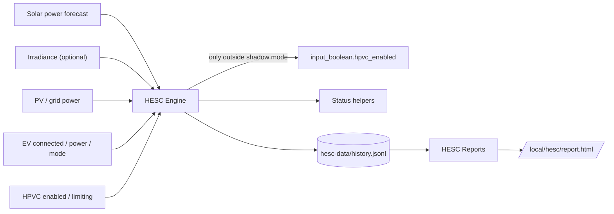
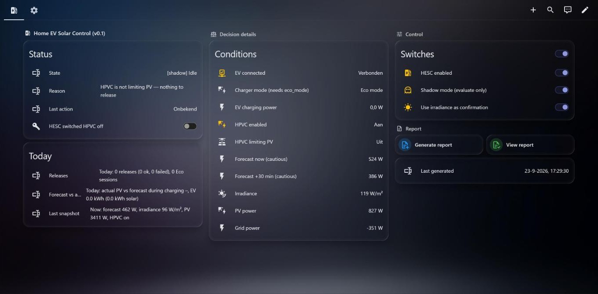
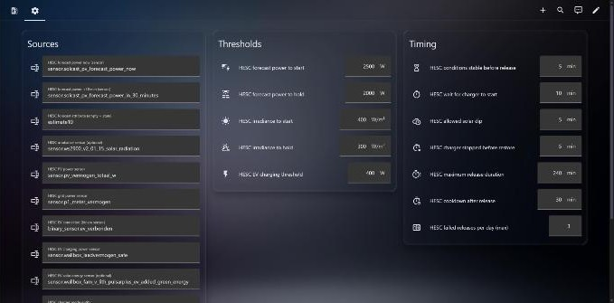
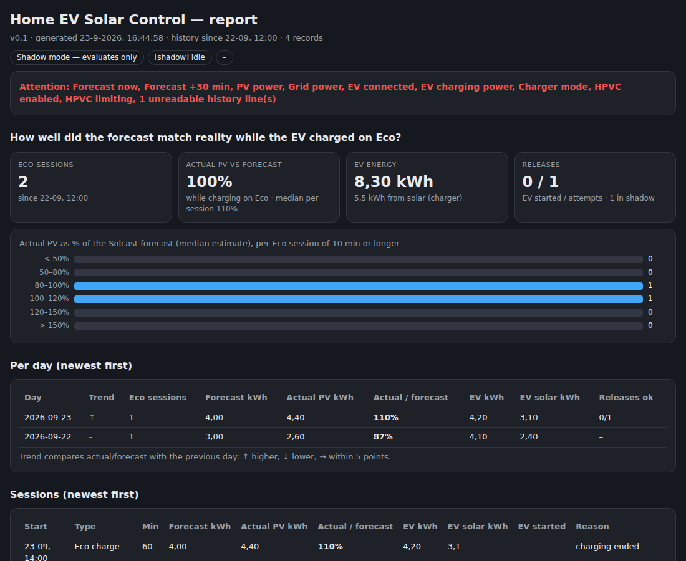

<p align="center">
  <a href="releases/v0.4.1/release.md"></a>
  <a href="https://www.home-assistant.io/"></a>
  <a href="https://nodered.org/"></a>
  <a href="LICENSE"></a>
  
</p>

# Home EV Solar Control

**Home EV Solar Control (HESC)** is a companion for [Home PV Control (HPVC)](https://github.com/BioPC/home-pv-control) and [Home Battery Control (HBC)](https://github.com/gitcodebob/marstek-venus-rs485-node-red). It keeps EV charging on solar working while HPVC limits your PV output.

Solar/Eco charging modes on many wallboxes only start when the house is exporting enough power. HPVC does the opposite: it curtails the inverters so that export stays near zero, for example at negative export prices. Both do their job, but together they block each other. The wallbox waits for surplus that never comes.

HESC resolves this. When the EV is connected and waiting in solar/Eco mode, HPVC is actively limiting, and the **solar power forecast** (optionally confirmed by a **local irradiance sensor**) says enough sun is coming, HESC briefly switches HPVC off so the charger can start. As soon as the EV charges, the sun drops, or the charger does not respond, HPVC takes over again.

> [!IMPORTANT]
> v0.4 is an early preview. It ships in **shadow mode**: it evaluates and logs every decision but never switches HPVC. Only switch shadow mode off after you have reviewed the report for your own installation.

## Contents

- [Quick install](#quick-install)
- [Main features](#main-features)
- [Requirements](#requirements)
- [Shipped defaults](#shipped-defaults)
- [How HESC works](#how-hesc-works)
- [Safety and recovery](#safety-and-recovery)
- [Accuracy, insights and reports](#accuracy-insights-and-reports)
- [Tested with](#tested-with)
- [Architecture and persistence](#architecture-and-persistence)
- [Documentation](#documentation)
- [Screenshots](#screenshots)
- [Support](#support)
- [Repository structure](#repository-structure)
- [Credits](#credits)
- [License](#license)
- [Disclaimer](#disclaimer)

## Quick install

1. Enable Home Assistant packages: `homeassistant: packages: !include_dir_named packages`
2. Copy `home assistant/hesc_config.yaml` to `/config/packages/hesc_config.yaml`
3. Restart Home Assistant (first install creates the helpers and applies the defaults once)
4. Import `node-red/hesc_flow.json` into Node-RED, select your Home Assistant server on the action and trigger nodes, and deploy
5. Add `home assistant/hesc_dashboard.yaml` as a separate dashboard
6. Open **Settings** and select your forecast, PV, grid, EV and charger entities (see [examples](examples/))
7. Leave **shadow mode** on and check the report after a few charging days

Full guide: [docs/01-installation.md](docs/01-installation.md)

## Main features

| Feature | |
|---|:-:|
| Unblocks wallbox Eco/solar charging while HPVC curtails PV | ✅ |
| Solar **power** forecast as primary source (Solcast `estimate10`, or any W sensor) | ✅ |
| Works with any charger that exposes connected, power and solar-mode entities (binary or status sensor, W or kW, one or more mode values, optional extra solar switch) | ✅ |
| Mapping table for common chargers: Wallbox, Alfen, Peblar, Zappi, go-e, Wattpilot, SMA, evcc, Ohme, Easee | ✅ |
| Local weather station (irradiance) fully optional | ✅ |
| Hysteresis (start/hold thresholds), stability timer, cooldown, daily attempt limit | ✅ |
| Shadow mode: full evaluation without writes | ✅ |
| Single write path: only the HPVC enable switch, with an ownership flag | ✅ |
| Forecast vs actual per solar/Eco charging session and per day | ✅ |
| Source reliability: forecast and irradiance vs actual PV every 15 minutes | ✅ |
| On-demand HTML support report | ✅ |
| Plain-language setting advice from your own history, only after a minimum number of sessions, following the seasons | ✅ |
| Separate Home Assistant dashboard in the HPVC layout: status badges, master-control toggles, live inputs, control-state timeline and a forecast vs actual graph | ✅ |
| No InfluxDB required (file-based history) | ✅ |

## Requirements

- Home Assistant with package support
- Node-RED with `node-red-contrib-home-assistant-websocket` (same version as HPVC recommends)
- [Home PV Control](https://github.com/BioPC/home-pv-control) installed and working (HESC uses `input_boolean.hpvc_enabled` and `binary_sensor.hpvc_pv_limited`)
- A charger with a solar/Eco charging mode exposed in Home Assistant (connected sensor, charging power sensor and a mode entity). See [Chargers and sources](docs/05-chargers-and-sources.md)
- A solar power forecast in watts (e.g. [Solcast PV Forecast](https://github.com/BJReplay/ha-solcast-solar) `power_now` / `power_in_30_minutes`, or any other forecast sensor in W)
- Optional: a local weather station with an irradiance sensor (W/m²). HESC works without one
- Optional: Home Battery Control. HESC only reads; it never writes to HBC
- For the dashboard graph: [apexcharts-card](https://github.com/RomRider/apexcharts-card) (HACS), the same card HPVC uses

## Shipped defaults

| Setting | Default | Meaning |
|---|---|---|
| Forecast power to start | 2 500 W | cautious forecast (now and +30 min) must reach this before a release |
| Forecast power to hold | 2 000 W | keep the release while above this (hysteresis) |
| Irradiance to start / hold | 400 / 300 W/m² | only when irradiance confirmation is enabled |
| Conditions stable before release | 5 min | ignore short sun peaks |
| Wait for charger to start | 10 min | wallboxes add their own start delay |
| Allowed solar dip | 5 min | a passing cloud does not end the release |
| Charger stopped before restore | 5 min | |
| Maximum release duration | 240 min | safety net |
| Cooldown after release | 30 min | prevents flapping |
| Failed releases per day | 3 | |
| EV charging threshold | 400 W | above this the EV counts as charging |

> [!NOTE]
> The start threshold is a **production** forecast, while the wallbox looks at **surplus** (production minus house load minus battery charging). Tune the thresholds with the report of your own installation.

## How HESC works

Every 30 seconds HESC reads a bounded set of entities from the Node-RED Home Assistant state cache (no API reads, no copy of the full state table) and runs a small state machine:

1. **Idle.** It waits until the EV is connected, not charging and in solar/Eco mode, HPVC is enabled and actively limiting, the cautious forecast (now and +30 min) is above the start threshold, the irradiance confirms (optional), and there is no cooldown or attempt limit. All of this must hold for the stability time.
2. **Release: waiting for EV.** HPVC is switched off and the ownership flag is set. The charger gets the configured time to start.
3. **Release: EV charging.** HPVC stays off while the EV charges and the solar conditions stay above the hold thresholds.
4. **Restore.** HPVC is switched on again, the ownership flag is cleared, and the cooldown starts.

In **shadow mode** steps 2–4 are simulated and logged, but nothing is written.

## Safety and recovery

- HESC switches **only** the HPVC enable switch, and only when it set the ownership flag itself.
- After a Node-RED or Home Assistant restart, HPVC is switched back on if HESC still owned it.
- Missing or unavailable inputs, sunset and the maximum duration always restore HPVC.
- If you switch HPVC on manually during a release, HESC abandons the release.
- Switching HESC off restores HPVC.
- Status helpers are written only when their value changes, to keep Home Assistant writes low.

## Accuracy, insights and reports

### Forecast vs actual

For every daytime solar/Eco charging session and every release, HESC records the forecast energy (Solcast median), the actual PV energy, **actual as % of forecast**, the EV energy and, when available, the solar share reported by the charger.

### How reliable are the sources?

Every 15 minutes in daylight HESC stores the forecast, the actual PV power and, if configured, the irradiance, also when no EV is connected. The report shows how close the forecast was, how often the cautious forecast held, and how well the weather station explains the PV output. Intervals in which HPVC limited PV are left out. See [Chargers and sources](docs/05-chargers-and-sources.md#how-reliable-are-my-sources).

### Dashboard

The dashboard follows the Home PV Control layout: status badges at the top, **EV Solar Master Control** with horizontal toggles, **Live Inputs**, **Control States** with a 12-hour timeline, and a **Solar forecast vs actual · EV** graph (actual PV, median and cautious forecast, EV charging power and the start threshold). The Settings tab groups forecast, the optional weather station (its fields are hidden when switched off), the charger, HPVC, and thresholds.

The graph and timeline use eight `hesc_diag_*` helper entities from the package. They mirror whatever sources you selected, so the dashboard works unchanged on every installation. The power helpers update once per minute to keep database writes low. If your recorder uses an include list, add them to it.

### Today

The dashboard shows today's releases (ok/failed), Eco sessions, forecast accuracy and EV solar kWh.

### Advice

Once a day (and with every report) HESC looks back over a recent period (default 30 days) and gives short advice in plain language: *this is what was measured, this is the advice*. For example: "Eco kept charging reliably from about 1,550 W expected surplus. House and battery used about 550 W together at those moments. Advice: start threshold 2,100 W."

Two quantities are kept apart: the **surplus** (forecast minus what house and battery use, derived from PV, grid and EV power at the start of each session) explains *why*; the **start threshold** is what you actually set, because HESC compares it with the gross forecast. No battery sensor is needed. Without a grid power sensor the advice falls back to the gross forecast and says so.

- **No advice without enough data.** Each advice needs a minimum number of sessions (default 8). Until then it says *collecting data*.
- **Follows the seasons.** Only the recent period counts, so the advice moves with the season. When the threshold advice moves, the report says so for a week.
- **Advice only.** HESC never changes a setting itself.
- Covers: start/hold threshold, wait time for the charger (needs real releases, so shadow mode off), releases without charging, forecast quality and, if switched on, the weather-station thresholds.

The current advice is shown on the dashboard and at the top of the report.

### Support report

**Generate report** builds an HTML report at `/local/hesc/report.html` with:

- the current advice;
- the forecast vs actual summary and distribution;
- source reliability (forecast and irradiance vs actual PV, per day);
- a per-day table (newest first, trend first);
- all sessions and decisions;
- live inputs with warnings;
- all settings;
- the runtime state.

## Tested with

HESC was developed and tested with a **Wallbox Pulsar Plus** (official Wallbox integration, solar charging mode *Eco*), **Solcast PV Forecast**, an **Ecowitt** weather station, **HPVC** and **HBC**. Other chargers should work when they expose the entities listed in [Chargers and sources](docs/05-chargers-and-sources.md); please test them in shadow mode first.

## Architecture and persistence



The Node-RED flow has four tabs: **Inputs** (30-second trigger and startup safety), **Engine** (state machine), **Outputs** (the only write path, plus the history file) and **Reports** (on demand, outside the evaluation cycle). History is stored as JSON lines in `/homeassistant/hesc-data/history.jsonl`.

## Documentation

- [Installation](docs/01-installation.md)
- [Settings](docs/02-configuration.md)
- [How it works](docs/03-how-it-works.md)
- [Troubleshooting](docs/04-troubleshooting.md)
- [Chargers and sources](docs/05-chargers-and-sources.md)
- [Documentation index](docs/README.md)
- [Changelog](CHANGELOG.md)
- [v0.4.1 release notes](releases/v0.4.1/release.md)
- [v0.4.0 release notes](releases/v0.4.0/release.md)
- [v0.3.0 release notes](releases/v0.3.0/release.md)
- [v0.2.0 release notes](releases/v0.2.0/release.md)
- [v0.1.0 release notes](releases/v0.1.0/release.md)

## Screenshots

Screenshots are from v0.1.0; the v0.3 dashboard layout differs.

### Dashboard



### Settings



### Report



## Support

1. Press **Generate report** and open `/local/hesc/report.html`.
2. Open an issue and attach the report, or the relevant parts of it.

## Repository structure

```text
home assistant/
  hesc_config.yaml      # Home Assistant package and helpers
  hesc_dashboard.yaml   # Separate Home Assistant dashboard

node-red/
  hesc_flow.json        # Importable Node-RED flow with four v0.4 tabs

examples/
  wallbox-pulsar-plus-solcast.reference.yaml

assets/
  screenshots/

docs/
  01-installation.md
  02-configuration.md
  03-how-it-works.md
  04-troubleshooting.md
  05-chargers-and-sources.md
  README.md

releases/
  v0.1.0/
  v0.2.0/
  v0.3.0/
  v0.4.0/
  v0.4.1/
```

## Credits

HESC is designed to work alongside [Home PV Control](https://github.com/BioPC/home-pv-control) and [Home Battery Control](https://github.com/gitcodebob/marstek-venus-rs485-node-red).

- **Layout and conventions:** the dashboard, the support report, the Node-RED tab structure (Inputs, Engine, Outputs, Reports), the first-install defaults and this repository layout are modelled on **Home PV Control** by [BioPC](https://github.com/BioPC) and **Home Battery Control** by [gitcodebob](https://github.com/gitcodebob). Thanks to both authors for the example they set.
- **Forecast:** [Solcast PV Forecast](https://github.com/BJReplay/ha-solcast-solar) by BJReplay.

## License

GPL-3.0-or-later. See [LICENSE](LICENSE).

## Disclaimer

You are responsible for your own configuration. HESC switches another controller (HPVC) off and on. Check its behaviour in shadow mode on your own installation before enabling it. This software comes without any warranty. The authors are not liable for energy costs, export penalties, equipment behaviour or any other consequence of its use.
