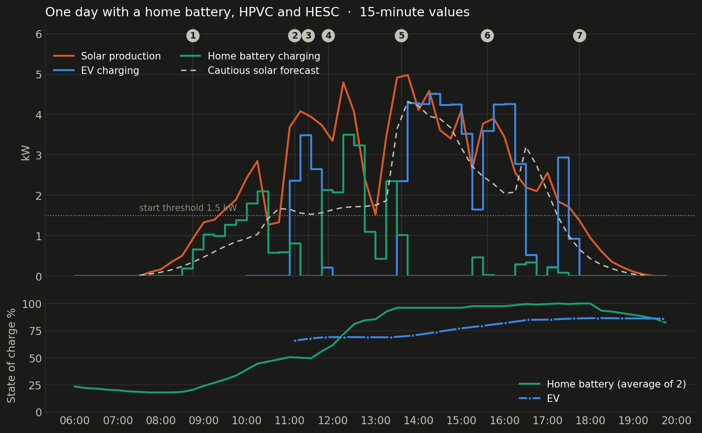

# A day in practice

What does HESC actually do on an ordinary day? This page follows one real day, **Sunday 27 September 2026**, on the installation where HESC is developed and tested. Clouds came and went, the washing machine ran, two home batteries wanted the sun as well, and the electricity price dropped to zero around noon. A good day to see how the parts work together.

My setup: HBC + HPVC + HEVS. Icons are illustrations for this page, not the official logos of the other projects.

## Who controls what

Each part has its own job, and none of them takes over another one's job:

| Part | Decides |
|---|---|
| **HBC** | when the home batteries charge and discharge |
| **HPVC** | how much the solar inverters may produce (only when exporting does not pay) |
| **The charger** | when it starts, pauses and stops on sun: its own Eco/solar control, based on the surplus per phase and its own delays |
| **HESC** | when to *ask* HPVC for a PV release, and when to start the charger for the charge plan. It follows everything else and writes it down |

**HESC does not change how the charger behaves.** It never regulates the charging current and never overrules the charger's solar mode. When the charger pauses because the house uses more power, that is the charger's own control, not HESC.

## The setup

| Part | What it does here |
|---|---|
| **[Home Battery Control (HBC)](https://github.com/gitcodebob/marstek-venus-rs485-node-red)** | Controls two home batteries (Marstek Venus, 5.12 kWh each). Strategy: *Dynamic* |
| **[Home PV Control (HPVC)](https://github.com/BioPC/home-pv-control)** v1.5.1 | Limits the solar inverters when exporting does not pay (price at or below zero) |
| **HESC / HEVS** v1.1.0 | Follows solar charging, asks HPVC for a PV release when the EV could charge on sun, runs the charge plan |
| Solar | 8 dimmable micro-inverters (450 W each) plus two inverters that cannot be dimmed (3.0 and 1.5 kW) |
| Charger | Wallbox Pulsar Plus in *Eco* mode (starts only when all three phases have enough surplus) |
| Forecast | Solcast, cautious estimate (`estimate10`); local weather station for irradiance |
| EV | Plugged in all day, battery at about 66% in the morning |

HESC settings were the shipped defaults: start at a cautious forecast of **1 500 W**, hold above **1 200 W**, weather station 150 / 120 W/m².

> [!NOTE]
> HESC runs here **with** HPVC. Everything HESC does apart from the release (following sessions, forecast vs actual, report, advice, charge plan) works the same **without** HPVC. See [the same day without HPVC](#the-same-day-without-hpvc-standalone) at the end.

## The day at a glance

The numbers in the chart match the moments below.

## What happened, step by step

### 1 · Morning: the batteries go first (06:00 – 11:00)

The home batteries ended the night at about 20%. From about 08:30 there was enough sun to charge them, and **HBC** sent the solar surplus into the batteries. By 10:30 they were at about 45% on average.

The electricity price was still above zero, so **HPVC** had no reason to limit anything. **HESC** had nothing to do either: the charger saw no surplus, because the batteries took it. That is intended. Meanwhile HESC stored, every 15 minutes, what Solcast predicted and what the panels actually produced.

> The cautious forecast is conservative on purpose. At 10:15 it said 1.0 kW, the panels made 2.8 kW.

### 2 · The charger starts on sun (11:07)

For the test, battery charging was paused for a quarter of an hour. The surplus went up straight away, and the Wallbox started charging on Eco at about 4.2 kW. HESC logged the session: 20 minutes, 1.3 kWh, of which 0.9 kWh from the sun. The panels produced **142%** of the cautious forecast.

Then the washing machine started heating, and a cloud passed. Eco cannot charge at less than about 4.1 kW (6 A on three phases), so it paused and resumed a few times between 11:16 and 11:44. Each pause is the charger's own decision: it looks at the surplus per phase. This is the charger's own control, not HESC.

### 3 · The charge plan uses a free quarter (11:26)

A charge plan was set for Tuesday 10:00, goal 100%. The day-ahead price for the quarter at 11:26 was **€ 0.00**, one of the cheapest quarters known before the deadline, so the plan had picked it. HESC started the charger for that quarter, two days before the deadline.

At 11:54 HESC saw that the charger had stopped by itself and marked the plan quarter as finished. The charge plan never takes over a session it did not start, and it leaves the charger in the mode it was in (here: Eco).

### 4 · HPVC limits, the batteries have priority, HESC asks and waits (11:54 – 13:19)

Around noon the price dropped to zero. **HPVC** started to limit the dimmable inverters, so that the house would not export at a loss. Battery charging was back on, and **HBC** took the surplus again. HPVC reported *HBC Charge Priority*: the battery goes first.

The EV was still plugged in and waiting in Eco mode. The cautious forecast was above 1 500 W and HPVC was limiting, so **HESC** did exactly what it is built for:

| Time | HESC | HPVC |
|---|---|---|
| 11:54 | Conditions stable for 5 minutes → **asks HPVC for a PV release** | *External PV release waiting*: first the battery |
| 11:59 | No confirmation within 5 minutes → **withdraws the request** (*HPVC busy*), cooldown 30 min | Keeps battery priority |
| 12:34 / 12:39 | Asks again / withdraws again | Battery still charging |
| 13:14 / 13:19 | Asks again / withdraws again | Battery still charging |

This is the safety design at work: **HPVC decides**, HESC only asks. HESC never switches HPVC off and never forces a release. While the batteries are charging, the EV simply waits.

### 5 · Batteries full, the EV takes over by itself (13:36)

At 13:36 the first battery was at 100% and the second one stopped charging at 92%. The sun came back strongly (4.7 kW, cautious forecast 4.3 kW). The surplus was now large enough on all three phases, and the Wallbox **started on Eco by itself**. No release was needed; HESC saw it and logged *EV is charging*.

The EV charged at about 4.2 kW for an hour and a half, from 70% to 79%. The second battery was topped up later in the afternoon and reached 100% around 17:00.

### 6 · Afternoon: clouds, Eco pauses, the battery tops up (15:00 – 17:00)

After 15:00 clouds and a lower sun brought production down to about 2 kW. Eco paused at 15:03, resumed at 15:08, stopped at 15:20 and started again later. The second battery took the surplus again. HESC went back to watching the forecast.

**HPVC switched off (15:36).** With the price still at zero, HPVC kept three inverters at about 5 W while the house was *importing* 1.8 kW for the EV. One inverter did not confirm its last command, and HPVC waited for it before changing anything else. HPVC was switched off by hand for the rest of the day. This is reported to the HPVC author in [home-pv-control#7](https://github.com/BioPC/home-pv-control/issues/7). With HPVC off, HESC simply reported *HPVC is not limiting PV — nothing to release* and kept following the charger.

**Enough surplus, still no start (16:24).** At 16:33 the house exported 1.46 kW in total, but per phase that was 223 W, 635 W and 590 W. One phase was below the charger's minimum, so Eco did not start. The total was enough; the phase was not. Again: the charger's own rule, not HESC.

### 7 · Evening: the sun fades, the batteries take over the house (17:00 – 19:45)

From 17:00 production dropped below 2.5 kW. Eco tried three more times (16:38, 17:14 and 17:38) and paused again after a few minutes each time, when the surplus on one of the phases fell away. After 17:45 the charger simply waited. The cautious forecast dropped below the hold threshold of 1 200 W around 17:30.

From about 18:15 the home batteries started to cover the house, as intended. After sunset HESC reported *Night*. The EV ended the day at 86%, twenty points more than in the morning.

### The day in numbers

| | |
|---|---|
| Solar production | 27.8 kWh |
| Cautious forecast for the whole day | 19.0 kWh |
| EV charged | 14.3 kWh in 8 sessions, of which 9.3 kWh (65%) from the sun |
| EV battery | 66% → 86% |
| Home batteries | about 20% at dawn → 100% (first at 13:30, second around 17:00) |

## What this day shows

- **The order of priority is clear and nobody fights.** The home battery first (HBC, confirmed by HPVC), then the EV. HESC asks, HPVC decides.
- **The cautious forecast is a safe start signal.** In 34 of the 43 daylight quarters the panels produced at least as much as the cautious forecast, typically 1.8 times as much. In the 26 quarters where the cautious forecast was above the start threshold of 1.5 kW, the panels made less than 1.5 kW only once (10:45, a passing cloud). And between 11:15 and 15:45 HPVC was limiting the panels, so the real potential was even higher. On this day the start threshold was not what kept the EV waiting: the battery priority was.
- **A cloudy day costs some grid power.** Eco cannot charge below about 4.1 kW. When a cloud passes, the rest comes from the grid until the charger pauses. That is why 65% of the EV energy came from the sun, not 100%.
- **The charger has its own control, and HESC leaves it alone.** Eco looks at the surplus per phase, not at the total: at 16:33 there was 1.46 kW surplus in total, but one phase had only 223 W, so it did not start. A washing machine or a cloud is enough for a pause. HESC does not change this behaviour; it only makes sure HPVC does not take the surplus away while the EV could use it.
- **A zero price is an opportunity for the charge plan.** The plan picks the cheapest known quarters, so a free quarter can be used days before the deadline. With *take cheap chances* on, it also uses every quarter below your own price limit.
- **HESC keeps a record of everything.** Sessions, forecast vs actual per quarter, every request and its outcome. That is what the report and the setting advice are built on.

## Screenshots from this day

Main dashboard at 14:59: EV charging on sun, HPVC limiting, forecast vs actual over the day.

## The same day without HPVC (standalone)

Without HPVC nothing limits the panels, so there is nothing to release. With **No HPVC (standalone)** switched on, the same day would have gone like this:

- **Morning:** the same. The batteries take the surplus, the charger waits, HESC records forecast vs actual.
- **11:07 – 11:44:** the same. Eco starts on sun and pauses when the surplus drops. HESC follows every session.
- **Around noon:** no curtailment. At a zero price the house would have exported instead. There are no release requests, so the table in step 4 disappears. The batteries still go first, because the charger only sees what is left after the house and the batteries.
- **13:36:** the same. When the batteries are full, Eco starts by itself.
- **Charge plan:** the same. It uses its own price sensor.

In short: standalone HESC is a smart companion for solar charging and for charging to a goal by a set time. HPVC adds one thing: when HPVC limits the panels, HESC can ask for a release so the EV gets the sun instead of nobody.

## Where the numbers come from

- Solar, EV and battery power and battery state of charge: Home Assistant history (15-minute averages).
- Forecast, actual PV, irradiance, sessions and requests: HESC's own history file (`hesc-data/history.jsonl`).
- EV state of charge: read from the car integration during the day.
