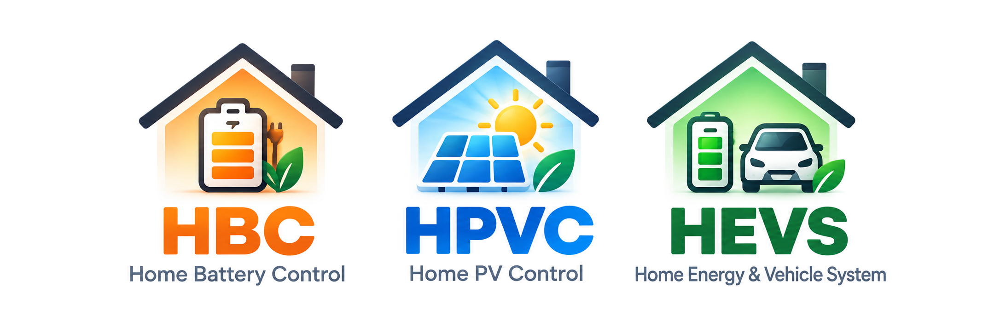
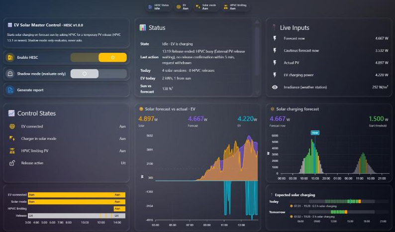

# A day in practice

What does HESC actually do on a normal day? Rather than explaining it with a list of features, I thought it would be more useful to show what happened during one real day.

So this is Sunday, 27 September 2026, at the installation where HESC is being developed and tested. It was a pretty good test day. There were clouds coming and going, the washing machine joined in, the two home batteries wanted their share of the solar power, the electricity price dropped to zero around noon, and the EV was plugged in all day.

In other words: not a laboratory test. Just a normal day at home.

My setup: HBC + HPVC + HEVS. Icons are illustrations for this page, not the official logos of the other projects.

## The setup

The installation has two Marstek Venus home batteries (5.12 kWh each), controlled by [Home Battery Control (HBC)](https://github.com/gitcodebob/marstek-venus-rs485-node-red), and solar panels on eight dimmable micro-inverters controlled by [Home PV Control (HPVC)](https://github.com/BioPC/home-pv-control), plus two inverters that cannot be dimmed. The charger is a Wallbox Pulsar Plus running in Eco mode. HESC sits alongside them, with its shipped default settings.

The important thing is that they each have their own job:

- **HBC** decides when the home batteries charge or discharge.
- **HPVC** decides how much the solar inverters are allowed to produce when exporting electricity is not worthwhile.
- **The Wallbox** decides when it can actually start, pause or stop charging in Eco mode. It looks at the surplus on each phase and has its own delays and minimum charging power.
- **HESC** does not take over any of that. It watches what is happening, keeps track of the forecast and the actual production, manages the charge plan and, when HPVC is limiting the solar, can ask HPVC for a temporary PV release. HPVC still makes the final decision.

That distinction turned out to be quite important during this day.

## The day at a glance

HESC main dashboard on this day at 14:59: EV charging on sun, HPVC limiting, forecast vs actual over the day.

## 1 · 06:00–11:00 — The batteries get the first share

The home batteries started the morning at around 20%. From about 08:30 there was enough solar power to charge them, so HBC took the available surplus. By 10:30 they were already around 45% on average.

There was no reason for HPVC to limit the solar at this point, because the electricity price was still above zero. And HESC had nothing to do with the EV yet: the Wallbox saw no usable surplus because the batteries were taking it. That is exactly what should happen.

Meanwhile, HESC was quietly doing its other job: every 15 minutes it recorded what Solcast expected and what the panels actually produced. The cautious forecast was deliberately conservative. At 10:15, for example, it predicted about 1.0 kW while the panels were actually producing 2.8 kW.

## 2 · 11:07 — The EV gets its chance

For the test, battery charging was paused for fifteen minutes. The effect was immediate: the solar surplus increased and the Wallbox started charging in Eco mode at about 4.2 kW. HESC recorded the session: 20 minutes, 1.3 kWh charged, of which 0.9 kWh came from solar. The panels were producing 142% of the cautious forecast.

Then reality happened. The washing machine started heating and a cloud passed over. The Wallbox cannot charge below roughly 4.1 kW, because it charges on three phases at 6 A minimum. So it paused and resumed several times between 11:16 and 11:44.

That was not HESC controlling the charger. That was the Wallbox doing exactly what it is supposed to do. HESC simply followed and recorded what happened.

## 3 · 11:26 — A free quarter appears

There was also a charge plan running, with the goal of 100% by Tuesday at 10:00. The plan looks at the known electricity prices and selects the cheapest quarters that can help reach the target.

At 11:26 the price was €0.00. That was one of the cheapest known quarters before the deadline, so the charge plan took the opportunity and HESC started the charger for that quarter. At 11:54 the charger had stopped by itself, and HESC marked the planned quarter as completed.

An important detail: the charge plan does not take over a charging session it did not start, and it puts the charger back in the mode it found it in. In this case, that was Eco.

## 4 · 11:54–13:19 — This is where HESC and HPVC have to work together

Around noon the electricity price dropped to zero. HPVC therefore started limiting the dimmable solar inverters, so the house would not export electricity at a loss. At the same time, battery charging was enabled again. HBC took the available surplus and HPVC reported that the batteries had priority.

The EV was still plugged in and waiting in Eco mode. This is the situation HESC was designed for. The forecast was high enough to expect useful solar power, but HPVC was limiting the panels.

So HESC asked HPVC for a temporary PV release. And then it waited.

HPVC did not release the solar, because the batteries were still charging. After five minutes without confirmation, HESC withdrew the request and went into its cooldown period.

It tried again later. And again. Each time, the result was the same: HPVC kept the battery priority.

This is an important part of the design. HESC does not switch HPVC off. It does not force a release. It simply asks. HPVC decides. While the batteries still have priority, the EV waits.

## 5 · 13:36 — The batteries are full, and everything changes

At 13:36 the first battery reached 100%. The second had stopped charging at about 92%. The sun was also strong again: about 4.7 kW of production, with a cautious forecast of 4.3 kW.

Suddenly there was enough surplus on all three phases, and the Wallbox started charging on Eco by itself. No PV release was necessary. HESC simply saw the charging session and recorded it.

The EV then charged at roughly 4.2 kW for about an hour and a half, taking the car from 70% to 79%. The second battery was topped up later in the afternoon and reached 100% around 17:00.

## 6 · 15:00–17:00 — Clouds are a much better test than sunshine

After 15:00 the clouds became more important and solar production dropped to around 2 kW. Eco paused at 15:03, resumed at 15:08, stopped again at 15:20, and later started again.

This is where the difference between HESC and the charger becomes very visible. HESC does not try to keep the charger running. The Wallbox decides for itself whether there is enough surplus on every phase. HESC just follows what actually happens.

At 15:36 there was another interesting event. With the price still at zero, HPVC kept three inverters at about 5 W while the house was *importing* 1.8 kW for the EV. One inverter had not confirmed its last command, and HPVC waited for it before changing anything else. I switched HPVC off manually for the rest of the day and reported it to the HPVC author in [home-pv-control#7](https://github.com/BioPC/home-pv-control/issues/7).

HESC handled that exactly as it should. It reported that HPVC was no longer limiting the PV, so there was nothing to release, and it simply continued following the charger.

Later, at 16:33, the house was exporting 1.46 kW in total. That sounds like plenty for an EV charger. But the three phases were at 223 W, 635 W and 590 W. One phase was below the Wallbox's minimum, so the car did not start. Again, that was not HESC making a decision. It was the charger's own three-phase Eco logic.

## 7 · 17:00–19:45 — The sun disappears

After 17:00 solar production fell below about 2.5 kW. The Wallbox made a few more attempts to start (16:38, 17:14 and 17:38), but each time the falling sun or a cloud reduced the surplus on one of the phases and Eco stopped again. After about 17:45 the car simply waited. The cautious forecast also dropped below HESC's 1.2 kW hold threshold at around 17:30.

From about 18:15 the home batteries started covering the house again. After sunset HESC reported *Night*.

The EV finished the day at 86%. It had started the morning at 66%.

## The numbers

The whole day produced 27.8 kWh of solar energy. The cautious forecast for the day was 19.0 kWh.

The EV charged 14.3 kWh across eight sessions. Of that, 9.3 kWh (about 65%) came from solar. The rest came from the grid in the moments when a cloud passed while the Wallbox was still charging at its minimum of about 4.1 kW, before it paused.

The EV battery went from 66% to 86%. The home batteries went from roughly 20% at dawn to 100%, the first reaching full charge around 13:30 and the second around 17:00.

The forecast held up well. In 34 of the 43 daylight quarters the panels produced at least as much as the cautious forecast, typically about 1.8 times as much. In the 26 quarters where the cautious forecast was above HESC's start threshold of 1.5 kW, actual production was below 1.5 kW only once (10:45, a passing cloud). And between 11:15 and 15:45 HPVC was limiting the panels, so the real potential was even higher. The shipped thresholds were a safe start signal. On this day, what kept the EV waiting was not the threshold, but the battery priority.

## So what did this day actually show?

For me, the most interesting part was not that the system charged the car. It was that the different parts could do their own jobs without fighting each other.

The home batteries get their priority. The EV gets whatever useful surplus is left. The Wallbox remains in control of its own Eco behaviour. HPVC remains in control of the solar inverters. And HESC sits between those worlds, watching what is happening and asking HPVC for a release only when that can make sense.

On this day, HESC asked several times while the batteries were still charging. HPVC said no. And that was the correct outcome. Later, when the batteries were full, the EV simply started by itself because there was enough surplus. No release was needed at all.

That is probably the most important thing I learned from running it for a full day:

**HESC does not need to control everything to make the whole system work better.**

It only needs to know when to ask, when to wait, and when to leave the other systems alone.

The same applies to the charge plan. It can spot a €0.00 quarter two days before the deadline, use it when appropriate, and then get out of the way again.

And because HESC records the forecast, actual production, charging sessions and release requests, you can look back afterwards and see why the system behaved the way it did.

That is what this first real-world day was really about. Not making the EV, batteries and PV compete for control. Just giving each of them their own job.

## And what happens without HPVC?

HESC also works without HPVC. Switch on **No HPVC (standalone)** in the settings. In that case there is simply nothing to release.

The batteries still get their surplus first, the Wallbox still controls its own Eco mode, the charge plan still works, and HESC still records the forecast and actual production.

HPVC adds one extra capability: when it is actively limiting the PV, HESC can ask it to temporarily release that PV, so the EV can use the available solar energy instead. That makes HESC useful on its own, but even more interesting as a companion to HPVC.

This was one real day, on one installation, with one Wallbox. There will undoubtedly be more edge cases to find. But after letting HESC run through a complete day of real household activity, the basic idea is proving itself in practice.

Where the numbers come from: solar, EV and battery power and battery state of charge from Home Assistant history (15-minute averages); forecast, actual PV, sessions and requests from HESC's own history file (`hesc-data/history.jsonl`); EV state of charge read from the car integration during the day.
