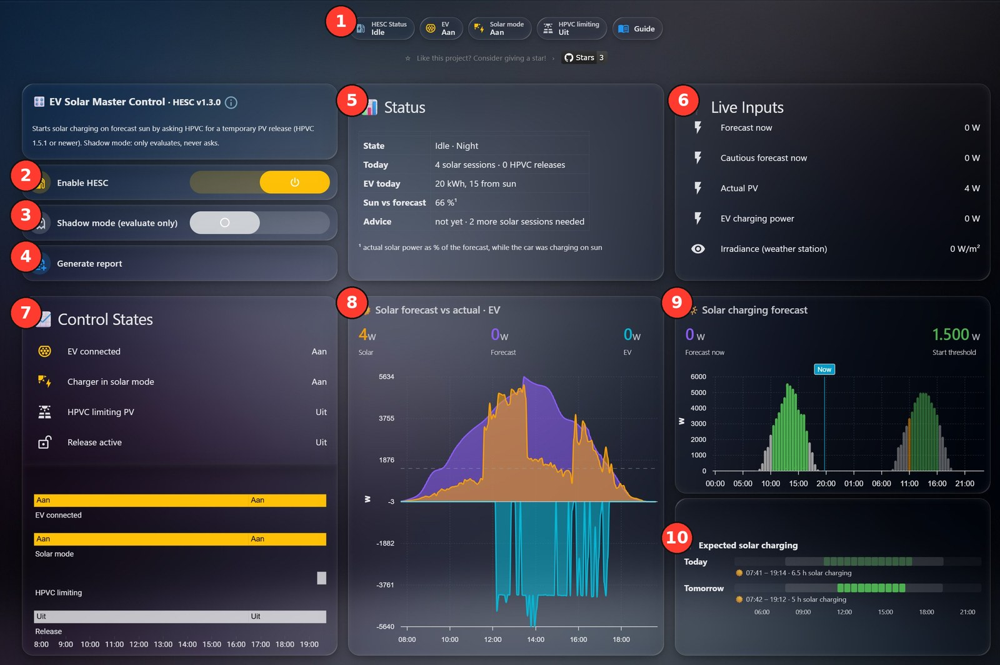
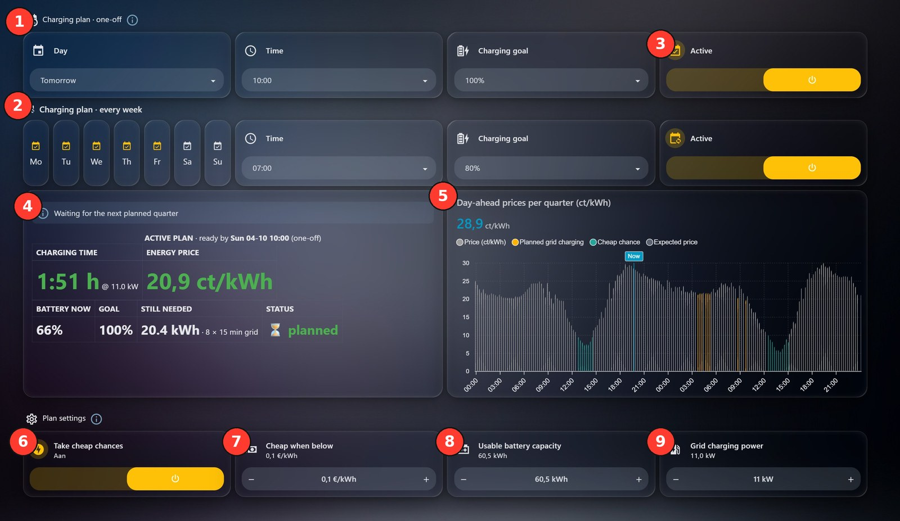
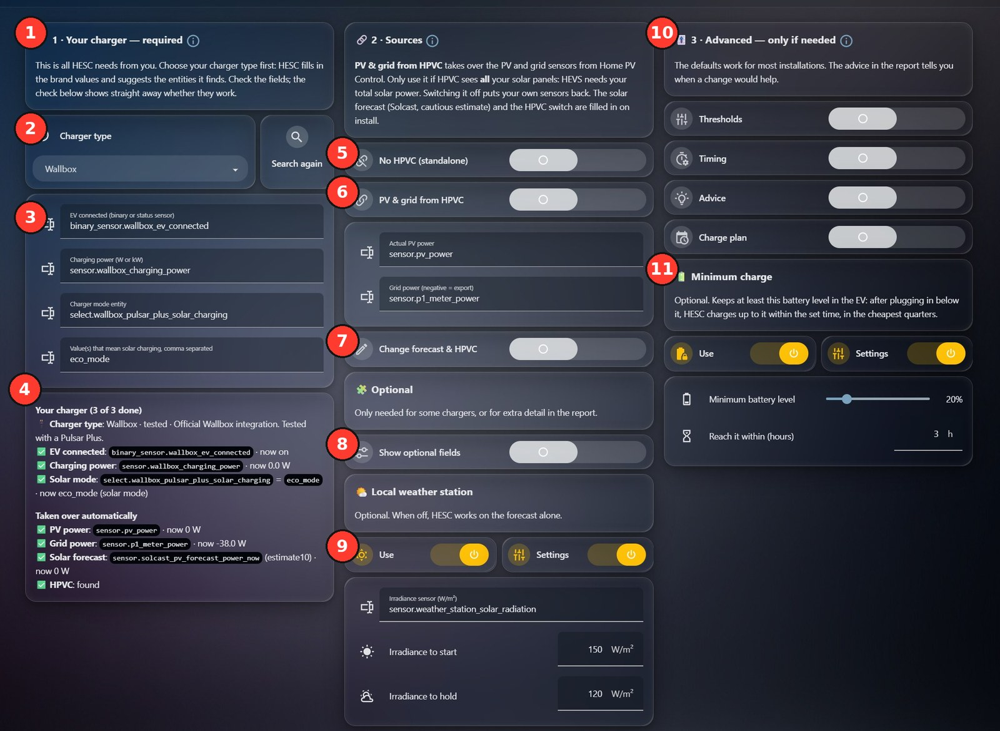

# Het dashboard uitgelegd

*Wat elk genummerd onderdeel van het HESC-dashboard doet.* (English: [The dashboard explained](08-dashboard.md))

Het HESC-dashboard heeft drie tabbladen: het **hoofdscherm**, het **laadplan** en de **instellingen**. Hieronder staat per scherm een genummerde screenshot met per nummer een korte uitleg.

## Hoofdscherm

1. **Statusbalk:** in één oogopslag wat HESC doet, of de auto is aangesloten, of de laadpaal op zonneladen staat en of HPVC de panelen afknijpt. *Guide* opent de uitleg, ook in het Nederlands.
2. **Enable HESC:** de hoofdschakelaar. Uit betekent dat HESC niets meer beoordeelt. Had HESC HPVC uitgezet, dan zet het HPVC eerst terug.
3. **Shadow mode:** HESC beoordeelt en logt alles, maar schakelt niets. Begin hier altijd mee.
4. **Generate report:** maakt een rapport met alles wat HESC gemeten en besloten heeft, inclusief advies. Daarna verschijnt de knop *View report*.
5. **Status:** wat HESC nu doet, hoeveel zonsessies en vrijgaven er vandaag waren, hoeveel de auto vandaag laadde en hoeveel daarvan van de zon kwam, en hoe goed de zonvoorspelling klopte. Na genoeg sessies staat hier ook of er advies is.
6. **Live Inputs:** de actuele waarden waarmee HESC rekent: de zonvoorspelling (gewoon en voorzichtig), de werkelijke opbrengst van je panelen, het laadvermogen van de auto en de instraling van het weerstation.
7. **Control States:** of de auto is aangesloten, de laadpaal op zonneladen staat, HPVC afknijpt en er een vrijgave loopt, met daaronder een tijdlijn van vandaag.
8. **Zonvoorspelling tegenover werkelijkheid:** paars is de voorspelling, oranje de werkelijke opbrengst, blauw (onder de nullijn) wat de auto laadde.
9. **Solar charging forecast:** de verwachte zon voor vandaag en morgen. Groen betekent genoeg zon om te starten, oranje genoeg om door te laden, grijs te weinig.
10. **Expected solar charging:** wanneer de auto vandaag en morgen naar verwachting op zon kan laden, en hoeveel uur.

## Laadplan

1. **Eenmalig plan:** kies een dag, een tijdstip en een laaddoel, bijvoorbeeld 100% morgen om 10:00.
2. **Weekplan:** vink de dagen aan en kies een tijdstip en een laaddoel, bijvoorbeeld 80% op werkdagen om 07:00.
3. **Active:** zet een plan aan of uit. Elk plan heeft een eigen schakelaar. Staan ze allebei aan, dan gaat het vroegste voor.
4. **Planstatus:** wat HESC nu doet, voor welk plan, hoe lang het laden duurt, de gemiddelde stroomprijs, de accustand nu, het doel, wat er nog nodig is en de status.
5. **Prijsgrafiek:** de stroomprijs per kwartier voor vandaag en morgen. Oranje is gepland laden van het net, blauwgroen een goedkope kans, grijs een verwachte prijs.
6. **Take cheap chances:** laadt ook zonder plan zodra de prijs onder de grens zakt, tenzij de zon die dag naar verwachting genoeg levert.
7. **Cheap when below:** de prijsgrens voor een goedkope kans, in euro per kWh.
8. **Usable battery capacity:** hoeveel kWh je auto echt kan gebruiken. Daarmee rekent HESC uit hoeveel energie er nodig is.
9. **Grid charging power:** hoeveel kW je laadpaal van het net levert. Daarmee rekent HESC uit hoeveel kwartieren er nodig zijn.

## Instellingen

1. **Stap 1, je laadpaal:** het enige deel dat je zelf moet invullen.
2. **Charger type en Search again:** kies je merk. HESC vult de waarden voor dat merk in en zoekt de entiteiten die erbij horen. *Search again* zoekt opnieuw.
3. **De velden:** auto aangesloten, laadvermogen, de entiteit met de laadstand en de waarde die zonneladen betekent. Controleer of ze kloppen.
4. **Controlelijst:** per veld een vinkje met de actuele waarde, zodat je meteen ziet of het werkt.
5. **No HPVC (standalone):** zet dit aan als je geen HPVC gebruikt. HESC slaat dan de vrijgave over en je kiest zelf je sensoren voor zon en net.
6. **PV & grid from HPVC:** neemt de sensoren voor zon en net over van HPVC. Gebruik dit alleen als HPVC al je panelen ziet. Uit zet je eigen sensoren terug.
7. **Change forecast & HPVC:** zet dit aan om de zonvoorspelling en de HPVC-onderdelen zelf te wijzigen.
8. **Show optional fields:** extra velden voor sommige laadpalen of voor meer detail in het rapport, zoals de accustand van de auto.
9. **Weerstation:** *Use* zet het weerstation aan of uit, *Settings* toont de sensor en de drempels. Zonder weerstation werkt HESC alleen op de voorspelling.
10. **Stap 3, geavanceerd:** drempels, timing, advies en de instellingen voor het laadplan. De standaardwaarden werken voor de meeste installaties. Het rapport vertelt je wanneer een aanpassing helpt.
11. **Minimumlading:** houdt de auto op minimaal een gekozen accustand, standaard 20% binnen 3 uur, in de goedkoopste kwartieren. Zet het aan met *Use*.

Meer uitleg: [Slim laden uitgelegd](07-smart-charging-explained.nl.md)
